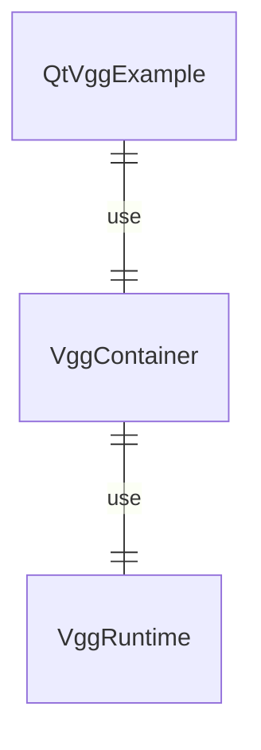

# vgg_qt
A Qt VGG Container library. 

## Overview

|Item|Description|
|-|-|
|QtVggExample|The application using Qt Vgg Container|
|VggContainer| Qt Vgg Container library |
|VggRuntime| C++ Vgg Runtime library|


## Getting Started

1. [Build](https://github.com/verygoodgraphics/vgg_runtime?tab=readme-ov-file#qt-building-example) VggContainer.
2. Build Counter example.  
   >Note: Change the vgg file [path](https://github.com/verygoodgraphics/vgg_qt/blob/main/examples/Counter/main.cpp#L17) if needed.

``` bash
cd /path/to/repo/examples/Counter

# Remove comment if you're building with clang
# export CC=clang
# export CXX=clang++

mkdir build
cd build

# macOS
cmake .. -DCMAKE_PREFIX_PATH=~/Qt/6.6.1/macos
cmake --build . --parallel 

# windows
cmake .. -DCMAKE_PREFIX_PATH=C:\Qt\6.6.3\msvc2019_64 -DCMAKE_BUILD_TYPE=Release
cmake --build . --parallel --config Release
```

## Usage
### CMake Project
1. Add `VggContainer` library.
```
add_subdirectory(<path/to/VggContainer> VggContainerBin)
target_link_libraries(MyApp PRIVATE
    VggContainer
)
target_include_directories(MyApp PRIVATE
  external
)
```
2. Use `QVggOpenGLWidget`.
```
#include "VggContainer/QVggOpenGLWidget.hpp"

auto vggFilePath = "<path/to/vggFile>";
QVggOpenGLWidget vggContainer;
vggContainer.show();
vggContainer.load(vggFilePath);

```


## Example
You can run our Counter example in this repository.